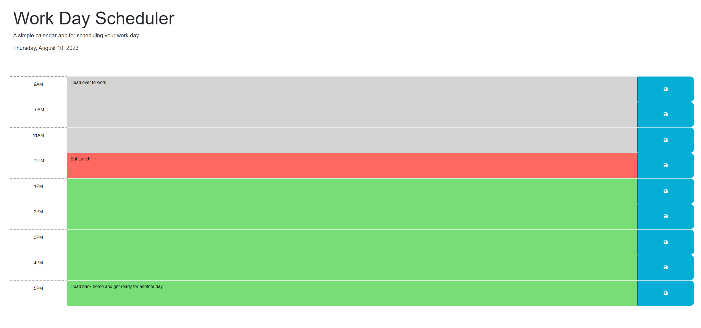

# Module-5-Challenge: Work Day Scheduler

## Description

A simple workday scheduler made with DayJs.

You can keep track of your plans throughout the day for the past, present, and future. The app also implements local storage, allowing you to save your plans for later use.

## Installation

No installation is required. Simply access the [live site](https://joseperez013.github.io/Work-Day-Scheduler/).

## Usage

Upon opening the page, you will find a planner with a 9-5 schedule block.

Type out your plans for the day and save them using the save button on the right side of each block. When saving, you will receive a confirmation with a pop-up message.

- Gray indicates the past, meaning the time has passed.
- Red indicates the present and what needs to be done.
- Green indicates the future and what is scheduled.

## License

MIT License

© 2023 JosePerez013

Permission is hereby granted, free of charge, to any person obtaining a copy of this software and associated documentation files (the "Software"), to deal in the Software without restriction, including without limitation the rights to use, copy, modify, merge, publish, distribute, sublicense, and/or sell copies of the Software. Permission is granted to anyone using this software, subject to the following conditions:

The above copyright notice and this permission notice shall be included in all copies or substantial portions of the Software.

THE SOFTWARE IS PROVIDED "AS IS," WITHOUT WARRANTY OF ANY KIND, EXPRESS OR IMPLIED, INCLUDING BUT NOT LIMITED TO THE WARRANTIES OF MERCHANTABILITY, FITNESS FOR A PARTICULAR PURPOSE AND NONINFRINGEMENT. IN NO EVENT SHALL THE AUTHORS OR COPYRIGHT HOLDERS BE LIABLE FOR ANY CLAIM, DAMAGES, OR OTHER LIABILITY, WHETHER IN AN ACTION OF CONTRACT, TORT, OR OTHERWISE, ARISING FROM, OUT OF, OR IN CONNECTION WITH THE SOFTWARE OR THE USE OR OTHER DEALINGS IN THE SOFTWARE.